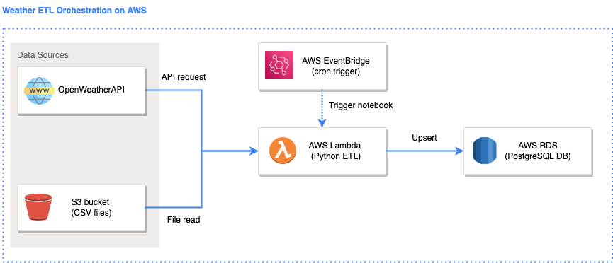

# Purpose and motivation

This repo is an extension of the [weather-etl](https://github.com/jonathanneo/weather-etl) example repo. The weather-etl example provides students of data engineering an example of an end-to-end ETL project that runs locally. 

This project, weather-etl-aws, provides student an example of the same project hosted on AWS. 


# Repo structure 
```
data/                                       # contains static datasets 
docs/                                       # contains additional documentation 
images/                                     # contains images used for the README
lambda_app/    
    |__ _config.template.sh                 # template for adding credentials and secrets 
    |__ ddl_create_table.sql                # SQL code used to create the target tables 
    |__ etl_lambda.py                       # contains the main etl logic 
    |__ etl_lambda_local.py                 # contains the etl logic to run locally 
    |__ test_transformation_functions.py    # pytest unit tests 
    |__ transform_functions.py              # custom user-generated transformation functions 
    |__ requirements.txt                    # python dependencies for lambda app 
    |__ build.sh                            # shell script to build the zip file 
README.md                                   # all you need to know is in here 
```

# Solution 

## Solution architecture 

The solution architecture diagram was created using: https://draw.io/ 

Icons were taken from: https://www.flaticon.com/ and https://www.vecta.io/ 




# Running locally 

Follow the steps below to run the code locally: 

- [1. Declare environment variables](#declare-environment-variables)
- [2. Run the application locally ](#run-the-application-locally)


### Declare environment variables 

If you look into the `etl_lambda.py` file, you will see that there are several lines for: 

```python 
# getting CSV_ENDPOINT_CAPITAL_CITIES environment variable 
CSV_ENDPOINT_CAPITAL_CITIES = os.environ.get("CSV_ENDPOINT_CAPITAL_CITIES")

# getting API_KEY_OPEN_WEATHER environment variable 
API_KEY_OPEN_WEATHER = os.environ.get("API_KEY_OPEN_WEATHER")
```

These lines are used to store variables that are either (1) secrets, or (2) change between environments (e.g. dev, test, production). 

We will first need to declare the values for these variables. This can easily be done by running the following in the terminal: 

<b>macOS:</b> 
```
export CSV_ENDPOINT_CAPITAL_CITIES="path_to_csv"
export API_KEY_OPEN_WEATHER="secret_goes_here"
export DB_USER="secret_goes_here" # e.g. postgres 
export DB_PASSWORD="secret_goes_here" # e.g. postgres 
export DB_SERVER_NAME="secret_goes_here" # e.g. localhost
export DB_DATABASE_NAME="secret_goes_here"
```

<b>windows:</b> 

```
set CSV_ENDPOINT_CAPITAL_CITIES=path_to_csv
set API_KEY_OPEN_WEATHER=secret_goes_here
set DB_USER=secret_goes_here
set DB_PASSWORD=secret_goes_here
set DB_SERVER_NAME=secret_goes_here
set DB_DATABASE_NAME=secret_goes_here
```

To save time running each variable in the terminal, you may wish to create script files to store the declaration of each variable. 

- macOS: store the declaration of the variables in a `config.local.sh` file 
    - run using `. ./config.local.sh` 
- windows: store the declaration of the variables in a `config.local.bat` file 
    - run using `config.local.bat` 


### Run the application locally 

To run the application locally, simply run `python etl_lambda_local.py`. 

`etl_lambda_local.py` will import the main function in `etl_lambda.py` and run it. 

If successful, you should see records appearing in your local postgres database. 

# AWS deployment  

Follow these steps to deploy the solution to AWS. 

- [1. Deploy PostgreSQL on AWS RDS](#deploy-postgresql-on-aws-rds)
- [2. Deploy S3 bucket](#deploy-s3-bucket)
- [3. Declare environment variables](#declare-environment-variables-1)
- [4. Test locally](#test-locally)
- [5. Deploy ETL to AWS Lambda](#deploy-etl-to-aws-lambda)
- [6. Deploy Cron Trigger on AWS EventBridge](#deploy-cron-trigger-on-aws-eventbridge)

### Deploy PostgreSQL on AWS RDS 

1. In the AWS Console, search for "RDS". 
2. Choose the region closest to you on the top-right e.g. Sydney (ap-southeast-2)
3. Select "Create database" 
4. Configure database. Note: Unless specified, leave the settings to default. 
    1. Select "PostgreSQL" 
    2. Select Version "12.9-R1" (for the free tier, you will need to use a version below 13). 
    3. Select templates: "Free tier"
    4. Provide a DB instance identifier. Note: this is the name that appears on AWS and not the actual name of the database or server. 
    5. Set master username: "postgres"
    6. Set master password: `<specify your password>`
    7. Set confirm password: `<specify your password>`
    8. In connectivity, set public access: "Yes" 
    9. In additional configuration, deselect "Enable automated backups" 
    10. Select "Create database" 
5. After the database has been deployed, select the database and go to "Security group rules" and select the Security Group(s) with Type: "CIDR/IP - Inbound". 
    1. In the Security Group, select "Inbound rules" 
    2. Select "Edit inbound rules" 
    3. Select "Add rule" and add a new rule for: 
        - Type: "All traffic" 
        - Protocol: "All" 
        - Port Range: "All" 
        - Source: "Anywhere-IPv4"
    4. Select "Save rules" 
6. Try connecting to your database now from PgAdmin4. You should be successful. 
7. After connecting to the database, create a new query tool and run [ddl_create_table.sql](lambda_app/ddl_create_table.sql) to create the database tables. 

### Deploy S3 bucket  

1. In the AWS Console, search for "S3". 
2. Select "Create bucket" 
3. Configure bucket. Note: Unless specified, leave the settings to default. 
    1. Provide bucket name
    2. AWS Region: Choose the region closest to you e.g. Sydney (ap-southeast-2)
    3. Deselect "Block all public access" 
    4. Select "Create bucket" 
4. After the bucket is deployed, go to the bucket and into the "Permissions" tab and into the bucket policy. Set the bucket policy to: 

    ```json
    {
        "Version": "2012-10-17",
        "Statement": [
            {
                "Sid": "PublicRead",
                "Effect": "Allow",
                "Principal": "*",
                "Action": [
                    "s3:GetObject",
                    "s3:GetObjectVersion"
                ],
                "Resource": "arn:aws:s3:::your-bucket-arn-here/*"
            }
        ]
    }
    ```

    Save changes. 

5. Upload [australian_capital_cities.csv](data/australian_capital_cities.csv) to the bucket. 
6. Keep in mind the URL for newly uploaded CSV file. 

### Declare environment variables 

If you look into the `etl_lambda.py` file, you will see that there are several lines for: 

```python 
# getting CSV_ENDPOINT_CAPITAL_CITIES environment variable 
CSV_ENDPOINT_CAPITAL_CITIES = os.environ.get("CSV_ENDPOINT_CAPITAL_CITIES")

# getting API_KEY_OPEN_WEATHER environment variable 
API_KEY_OPEN_WEATHER = os.environ.get("API_KEY_OPEN_WEATHER")
```

These lines are used to store variables that are either (1) secrets, or (2) change between environments (e.g. dev, test, production). 

We will first need to declare the values for these variables. This can easily be done by running the following in the terminal: 

<b>macOS:</b> 
```
export CSV_ENDPOINT_CAPITAL_CITIES="path_to_csv" # from S3 object url
export API_KEY_OPEN_WEATHER="secret_goes_here"
export DB_USER="secret_goes_here" # e.g. postgres 
export DB_PASSWORD="secret_goes_here" # e.g. postgres 
export DB_SERVER_NAME="secret_goes_here" # e.g. postgres server host name on AWS 
export DB_DATABASE_NAME="secret_goes_here" 
```

<b>windows:</b> 

```
set CSV_ENDPOINT_CAPITAL_CITIES=path_to_csv
set API_KEY_OPEN_WEATHER=secret_goes_here
set DB_USER=secret_goes_here
set DB_PASSWORD=secret_goes_here
set DB_SERVER_NAME=secret_goes_here
set DB_DATABASE_NAME=secret_goes_here
```

To save time running each variable in the terminal, you may wish to create script files to store the declaration of each variable. 

- macOS: store the declaration of the variables in a `config.aws.sh` file 
    - run using `. ./config.aws.sh` 
- windows: store the declaration of the variables in a `config.aws.bat` file 
    - run using `config.aws.bat` 


### Test locally 

At this point, it is a good idea to test that everything still works when running the ETL code using a combination of services deployed on AWS and running locally. 

```
# declare the environment variables (macOS)
. ./config.aws.sh

# or, declare the environment variables (windows)
config.aws.bat

# run the ETL app 
python etl_lambda_local.py
```

If successful, then proceed on to the next step, otherwise troubleshoot the issue. 


### Deploy ETL to AWS Lambda

#### Build app

Before we can deploy the app, we need to first build the app. 

Building the app refers to packaging and compiling the app so that it is in a state that can be readily deployed onto the target platform (e.g. AWS, Heroku, Azure, GCP, etc). We can skip the compilation since Python is not a compiled language, however we still need to package the app. 

To package the app, we will run the following lines of code: 

<b>macOS</b>:
```
pip install --target ./.package -r ./requirements.lambda.txt
cd .package
zip -r ../lambda_package.zip .
cd ..
zip -g ../lambda_package.zip etl_lambda.py transform_functions.py
```

<b>windows</b>:

Note for Windows-only - You will need to install 7z (7-zip) which is a command line tool used for zipping files. 

1. Go to https://www.7-zip.org/ and download the version for your windows PC (usually 64-bit x64)
2. Run the installer .exe file 
3. Add the path `C:\Program Files\7-Zip` to your environment variables `path` 


```
pip install --target ./.package -r ./requirements.lambda.txt
cd .package
7z a -tzip ../lambda_package.zip .
cd ..
7z a -tzip lambda_package.zip etl_lambda.py transform_functions.py
```


This will produce a `.zip` file which contains all the code and library packages required to run the app on AWS Lambda. Note that some libraries like Pandas and Numpy were not packaged in the process as those libraries need to be packaged using a linux machine, whereas we are using Mac or Windows machines. So instead, we will use Layers in AWS Lambda later. 

For re-use, we've stored the commands in [build.sh](lambda_app/build.sh) and [build.bat](lambda_app/build.bat) respectively. 

You can just build the app by running either 

<b>macOS</b>:
```
. ./build.sh
```

<b>windows</b>:
```
build.bat
```

#### Deploy app

1. In the AWS Console, search for "Lambda". 
2. Choose the region closest to you on the top-right e.g. Sydney (ap-southeast-2)
3. Select "Create function" 
4. Configure the lambda function. Note: Unless specified, leave the settings to default. 
    1. Provide function name 
    2. Runtime: Python 3.9
    3. Select "Create function" 
5. After the lambda function is deployed, go to the "Code" section, and select "Upload from" > ".zip file" and provide the .zip file you have built. Click "save" and allow up to 2 mins for the file to be uploaded and processed. 
6. In the "Code" section go to "Runtime settings" and select "Edit". 
    1. We need to tell AWS Lambda which file and function to execute. 
    2. In "Handler", specify: "etl_lambda.lambda_function".
    3. Select "Save" 
7. In the "Code" section, scroll down to "Layers" and select "Add a layer". 
    1. As previously mentioned, some libraries need to be installed using a linux machine as AWS Lambda is running on linux machines. However, we have Mac and Windows machines. So we will use a "Layer" which is a set of packaged libraries we can use. We will be using layers provided by https://github.com/keithrozario/Klayers. For a list of available packaged libraries in Sydney (ap-southeast-2), see: https://api.klayers.cloud//api/v2/p3.9/layers/latest/ap-southeast-2/json. The Layer we will be using is the pandas layer. 
    2. In the Layer config, select "Specify an ARN" and provide "arn:aws:lambda:ap-southeast-2:770693421928:layer:Klayers-p39-pandas:1" and select "Verify". 
    3. After the layer is verified, select "Add" 
8. In the "Configuration" section, go to "Environment variables" and select "Edit". You will now create environment variables that correspond to your `config.aws.sh` or `config.aws.bat` files. 
    1. Select "Add environment variable" and proceed to populate the "Key" and "Value" pairs for each environment variable corresponding to your `config.aws.sh` or `config.aws.bat` files. 
9. In the "Configuration" section, go to "General configuration" and change the timeout to 30 seconds. 
10. In the "Test" section, click on the "Test" button to trigger your lambda function. If successful, you should see more records appear in your database. 

### Deploy Cron Trigger on AWS EventBridge 

Finally, we can look at automating the scheduling of the ETL job. 

1. In the AWS Console, search for "EventBridge". 
2. Choose the region closest to you on the top-right e.g. Sydney (ap-southeast-2)
3. Select "Create create" 
4. Configure EventBridge. Note: Unless specified, leave the settings to default. 
    1. Provide a rule name 
    2. Define pattern: "Schedule" 
    3. Fixed rate every: "2" "minutes" (you can set it to every 2 minutes to try it out)
    4. Select targets: "Lambda function"
    5. Function: `select your function name`
    6. Select "Create" 
5. Wait until your trigger runs and check your database again. You should see more records appear. 

